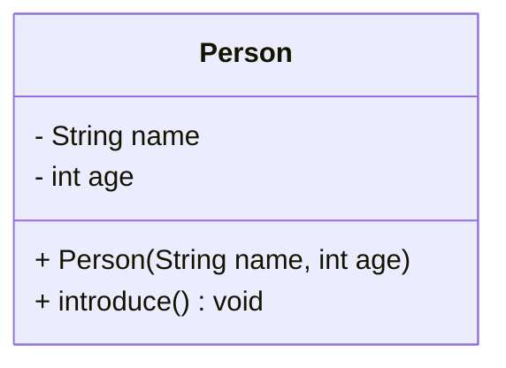

## Chapter 3. 메서드와 클래스

### 3.1 메서드(Methods)

- **정의**: 메서드는 특정 작업을 수행하는 코드 블록으로, 반복되는 코드를 줄이고 프로그램을 모듈화함.  
- **구조**:  
[접근제어자] [반환타입] 메서드명([매개변수]) {
// 실행 코드
```java
[return 반환값;]
}
```

- **접근제어자**: public, private, protected, default  
- **반환타입**: void(없음), int, String 등  
- **매개변수**: 메서드에 전달하는 입력값, 여러 개 가능

#### 3.1.1 메서드 예제
```java
public static void greet(String name) {
System.out.println("안녕하세요, " + name + "님!");
}

greet("홍길동"); // 출력: 안녕하세요, 홍길동님!
```


#### 3.1.2 반환값 있는 메서드
```java
public static int add(int a, int b) {
return a + b;
}

int sum = add(10, 20);
System.out.println("합계: " + sum); // 30 출력
```


#### 3.1.3 메서드 오버로딩

- 같은 이름의 메서드를 매개변수 타입이나 개수에 따라 여러 개 정의 가능  
- 다양한 입력을 처리할 때 유용
```java
public static int multiply(int a, int b) {
return a * b;
}

public static double multiply(double a, double b) {
return a * b;
}

System.out.println(multiply(3, 4)); // 12
System.out.println(multiply(3.5, 2.0)); // 7.0

```

---

### 3.2 클래스와 객체

- **클래스**: 객체를 만들기 위한 설계도, 속성과 기능을 정의  
- **객체**: 클래스의 인스턴스, 실제 메모리에 생성된 실체

#### 3.2.1 클래스 구조 (UML 다이어그램)



- `-` : private 필드 (외부에서 직접 접근 불가)  
- `+` : public 메서드 (외부에서 호출 가능)  
- 생성자는 객체 초기화 담당

#### 3.2.2 클래스 코드 예제
```java
public class Person {
private String name;
private int age;

text
// 생성자: 객체 생성 시 초기화
public Person(String name, int age) {
    this.name = name;
    this.age = age;
}
```
// 메서드: 객체의 기능
```java
public void introduce() {
    System.out.println("저는 " + name + "이고, " + age + "살입니다.");
}
}

text

#### 3.2.3 객체 생성 및 사용

Person p1 = new Person("홍길동", 25);
p1.introduce(); // 출력: 저는 홍길동이고, 25살입니다.

```

---

### 3.3 생성자(Constructor)

- 객체 생성 시 호출되어 필드를 초기화하는 특수 메서드  
- 이름이 클래스 이름과 같고 반환 타입이 없음  
- 생성자 오버로딩 가능 (매개변수에 따라 여러 개 선언)
```java
public class Car {
private String model;

```
// 기본 생성자
```java
public Car() {
    this.model = "기본 모델";
}

// 매개변수 있는 생성자
public Car(String model) {
    this.model = model;
}

public void showModel() {
    System.out.println("모델명: " + model);
}
}
```
```java
undefined
Car car1 = new Car();
car1.showModel(); // 모델명: 기본 모델

Car car2 = new Car("소나타");
car2.showModel(); // 모델명: 소나타

```
---

### 3.4 접근 제어자(Access Modifiers)

| 제어자   | 접근 범위                                   | 설명                          |
| -------- | ------------------------------------------ | ----------------------------- |
| public   | 모든 클래스에서 접근 가능                   | 가장 개방적인 접근             |
| private  | 같은 클래스 내에서만 접근 가능              | 외부 접근 차단, 캡슐화 핵심    |
| protected| 같은 패키지 + 상속받은 클래스에서 접근 가능 | 상속 관계에서만 접근 허용      |
| default  | 같은 패키지 내에서만 접근 가능              | 접근 제어자 생략 시 기본값     |

- **캡슐화**: 필드를 private로 숨기고, public getter/setter로 접근 제어
```java
public class Account {
private int balance;

text
public int getBalance() {
    return balance;
}

public void deposit(int amount) {
    if (amount > 0) {
        balance += amount;
    }
}
}

```
---

### 3.5 상속(Inheritance)과 다형성(Polymorphism)

#### 3.5.1 상속 개념

- 기존 클래스(부모)의 속성과 메서드를 새 클래스(자식)가 물려받음  
- 코드 재사용과 유지보수에 유리  
- 자바는 단일 상속만 지원 (하나의 부모 클래스만 상속 가능)

Animal (부모 클래스)
↑
Dog (자식 클래스)


#### 3.5.2 상속 예제
```java
public class Animal {
public void sound() {
System.out.println("동물이 소리를 냅니다.");
}
}

public class Dog extends Animal {
@Override
public void sound() {
System.out.println("멍멍");
}
}

```

#### 3.5.3 다형성

- 부모 타입 참조변수로 자식 객체를 참조 가능  
- 실행 시점에 자식 클래스 메서드가 호출됨 (동적 바인딩)
```java
Animal animal = new Dog();
animal.sound(); // 출력: 멍멍

```

---

### 3.6 인터페이스(Interface)

- 추상 메서드와 상수만 선언 가능  
- 다중 상속 효과를 내며, 구현 클래스는 반드시 메서드 구현
```java
public interface Flyable {
void fly();
}

public class Bird implements Flyable {
@Override
public void fly() {
System.out.println("새가 날아갑니다.");
}
}

```

---

### 3.7 예외 처리(Exception Handling)

- 프로그램 실행 중 발생하는 오류를 처리하는 방법  
- `try-catch-finally` 블록 사용
```java
try {
int result = 10 / 0;
} catch (ArithmeticException e) {
System.out.println("0으로 나눌 수 없습니다.");
} finally {
System.out.println("예외 처리 완료.");
}

```

---

### 3.8 요약 다이어그램 (텍스트 UML)
```mermaid 
classDiagram
    class 클래스 {
        - 필드
        + 메서드()
    }

    class 인터페이스 {
        <<interface>>
        + 추상메서드()
        + 상수
    }

    class 자식클래스
    class 구현클래스

    클래스 <|-- 자식클래스 : extends
    인터페이스 <|.. 구현클래스 : implements

 ```
---

### 3.9 실습 팁

- 클래스 설계 시, **책임과 역할**을 명확히 하자  
- 필드는 `private`으로 감추고, 필요한 메서드만 `public`으로 노출  
- 상속은 **is-a 관계**일 때만 사용 (예: 강아지는 동물이다)  
- 인터페이스는 **can-do 관계** 표현 (예: 새는 날 수 있다)  
- 예외는 예상 가능한 오류만 처리하고, 무분별한 catch는 피하기

---

### 3.10 참고자료

- [자바 공식 문서: 클래스와 객체](https://docs.oracle.com/javase/tutorial/java/javaOO/index.html)  
- 생활코딩 - 자바 객체지향 프로그래밍 강의  
- 인프런 - 자바 완전 정복 강의  

---
