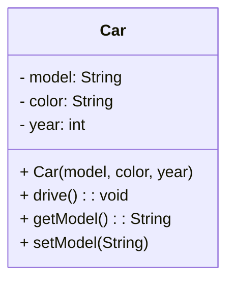
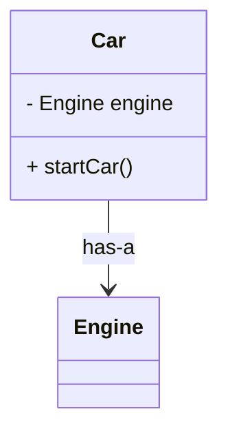

## Chapter 5. 객체지향 프로그래밍 (Object-Oriented Programming in Java)

### 5.1 클래스(Class)와 객체(Object)

- **클래스**는 객체를 생성하기 위한 설계도(청사진)로, 데이터(필드)와 기능(메서드)을 포함함.
- **객체**는 클래스의 인스턴스로, 실제 메모리에 생성되어 동작하는 실체.

#### 5.1.1 클래스 기본 구조
```java
public class Car {
// 필드 (속성)
private String model;
private String color;
private int year;

```
```java
// 생성자 (객체 초기화)
public Car(String model, String color, int year) {
    this.model = model;
    this.color = color;
    this.year = year;
}

// 메서드 (기능)
public void drive() {
    System.out.println(model + "가(이) 달립니다.");
}

// Getter 메서드
public String getModel() {
    return model;
}

// Setter 메서드
public void setModel(String model) {
    this.model = model;
}

// 기타 getter/setter 생략...
}

```

- **필드**: 객체의 상태를 저장하는 변수들  
- **생성자**: 객체 생성 시 필드를 초기화하는 특수 메서드  
- **메서드**: 객체가 수행하는 동작  
- **캡슐화**: 필드는 `private`으로 숨기고, `public` 메서드로 접근 제어  

#### 5.1.2 객체 생성과 사용
```java
Car myCar = new Car("소나타", "검정", 2020);
System.out.println("내 차 모델: " + myCar.getModel());
myCar.drive(); // 출력: 소나타가(이) 달립니다.

```

---

### 5.2 메서드(Method) 심화

- 메서드는 클래스 내에서 동작을 정의하며, 입력값(매개변수)과 반환값을 가질 수 있음.
- **오버로딩**: 같은 이름의 메서드를 매개변수 타입/개수에 따라 여러 개 정의 가능.

#### 5.2.1 메서드 오버로딩 예제
```java
public class Calculator {
public int add(int a, int b) {
return a + b;
}

text
public double add(double a, double b) {
    return a + b;
}

public int add(int a, int b, int c) {
    return a + b + c;
}
}


undefined
Calculator calc = new Calculator();
System.out.println(calc.add(1, 2)); // 3
System.out.println(calc.add(1.5, 2.5)); // 4.0
System.out.println(calc.add(1, 2, 3)); // 6

```
---

### 5.3 클래스 다이어그램 (UML)




- `-` : private 필드  
- `+` : public 메서드  
- 생성자는 클래스 이름과 동일하며 반환 타입 없음

---

### 5.4 상속(Inheritance)

- 기존 클래스를 확장하여 새로운 클래스를 만들고, 부모 클래스의 필드와 메서드를 물려받음.
- 코드 재사용과 다형성(polymorphism) 구현에 필수.

#### 5.4.1 상속 예제
```java
public class Animal {
public void sound() {
System.out.println("동물이 소리를 냅니다.");
}
}

public class Dog extends Animal {
@Override
public void sound() {
System.out.println("멍멍");
}
}


undefined
Animal animal = new Animal();
animal.sound(); // 출력: 동물이 소리를 냅니다.

Dog dog = new Dog();
dog.sound(); // 출력: 멍멍

```

---

### 5.5 다형성(Polymorphism)

- 부모 클래스 타입의 변수로 자식 클래스 객체를 참조할 수 있음.
- 실행 시점에 실제 객체의 메서드가 호출되는 동적 바인딩.
```java
Animal animal = new Dog();
animal.sound(); // 출력: 멍멍

```

---

### 5.6 추상 클래스(Abstract Class)와 인터페이스(Interface)

- **추상 클래스**: 일부 구현된 메서드와 추상 메서드(구현 없는 메서드)를 가질 수 있음. 상속받아 구체화함.
```java
public abstract class Shape {
public abstract double area(); // 추상 메서드

text
public void display() {
    System.out.println("도형의 면적: " + area());
}
}

public class Circle extends Shape {
private double radius;

```
```java
public Circle(double radius) {
    this.radius = radius;
}

@Override
public double area() {
    return Math.PI * radius * radius;
}
}

```

- **인터페이스**: 모든 메서드가 추상 메서드이며, 다중 상속 가능.
```java
public interface Movable {
void move();
}

public class Car implements Movable {
@Override
public void move() {
System.out.println("차가 움직입니다.");
}
}

```

---

### 5.7 객체 합성(Composition)

- 클래스가 다른 클래스 객체를 필드로 포함하는 관계.
- “~은 ~을 가진다” 관계 표현.
```java
public class Engine {
public void start() {
System.out.println("엔진 시동");
}
}

public class Car {
private Engine engine;

```
```java
public Car() {
    engine = new Engine();
}

public void startCar() {
    engine.start();
    System.out.println("차가 출발합니다.");
}
}

```

---

### 5.8 예외 처리(Exception Handling)

- 프로그램 실행 중 발생할 수 있는 오류를 처리하는 메커니즘.
- `try-catch-finally` 블록 사용.
```java
try {
int result = 10 / 0;
} catch (ArithmeticException e) {
System.out.println("0으로 나눌 수 없습니다.");
} finally {
System.out.println("예외 처리 완료.");
}

```
---

### 5.9 클래스와 객체 관계 다이어그램




---

### 5.10 실습 문제

1. `Car` 클래스를 만들고, `Engine` 클래스를 합성하여 시동 걸기 기능 구현해보기  
2. `Animal` 클래스를 상속받아 `Cat` 클래스를 만들고, `sound()` 메서드를 오버라이딩 해보기  
3. 추상 클래스 `Shape`를 상속받아 `Rectangle` 클래스를 만들고, 면적을 계산하는 메서드 구현하기  
4. 인터페이스 `Movable`을 구현하는 `Bicycle` 클래스를 작성하고, `move()` 메서드 구현하기  
5. 예외 처리로 사용자 입력을 받아 정수 나누기 프로그램 작성하기

---

### 5.11 참고자료

- [Java Programming - Object Oriented Programming (PDF)](https://www.cp.eng.chula.ac.th/books/wp-content/uploads/sites/5/2018/01/java101.pdf)  
- [Java Class Diagrams - MOOC](https://java-programming.mooc.fi/part-11/1-class-diagrams/)  
- [Java Notes - IIT Kanpur](https://www.iitk.ac.in/esc101/share/downloads/javanotes5.pdf)  
- 생활코딩 - 자바 객체지향 프로그래밍 강의  
- 인프런 - 자바 완전 정복 강의  

---
