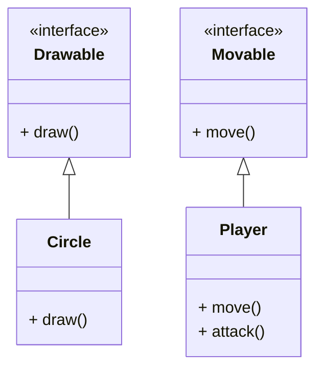

### 6.1 인터페이스(Interface)

- **인터페이스**는 클래스가 구현해야 하는 메서드의 목록(규약)만 정의한 추상 타입  
- 모든 메서드는 기본적으로 `public abstract`이며, 필드는 `public static final` 상수만 가질 수 있음  
- 다중 상속이 가능하여 여러 인터페이스를 한 클래스가 구현할 수 있음

#### 6.1.1 인터페이스 선언 예제
```java
public interface Drawable {
void draw(); // 추상 메서드
}

```

#### 6.1.2 인터페이스 구현 예제
```java
public class Circle implements Drawable {
@Override
public void draw() {
System.out.println("원을 그립니다.");
}
}

public class Rectangle implements Drawable {
@Override
public void draw() {
System.out.println("사각형을 그립니다.");
}
}

```

#### 6.1.3 인터페이스 사용 예제
```java
Drawable d1 = new Circle();
Drawable d2 = new Rectangle();

d1.draw(); // 출력: 원을 그립니다.
d2.draw(); // 출력: 사각형을 그립니다.

```

---

### 6.2 추상 클래스(Abstract Class)

- 추상 클래스는 일반 클래스와 달리 하나 이상의 추상 메서드를 가질 수 있으며, 직접 인스턴스 생성 불가  
- 추상 메서드는 선언만 있고 구현은 서브클래스에서 반드시 해야 함  
- 인터페이스와 달리 필드와 일반 메서드도 가질 수 있음

#### 6.2.1 추상 클래스 선언 예제
```java
public abstract class Animal {
public abstract void sound(); // 추상 메서드


public void breathe() {
    System.out.println("숨을 쉽니다.");
}
}

```java

#### 6.2.2 추상 클래스 상속 및 구현 예제
```java
public class Dog extends Animal {
@Override
public void sound() {
System.out.println("멍멍");
}
}

public class Cat extends Animal {
@Override
public void sound() {
System.out.println("야옹");
}
}

```

#### 6.2.3 추상 클래스 사용 예제
```java
Animal dog = new Dog();
Animal cat = new Cat();

dog.breathe(); // 출력: 숨을 쉽니다.
dog.sound(); // 출력: 멍멍
cat.sound(); // 출력: 야옹

```

---

### 6.3 인터페이스 vs 추상 클래스 비교

| 구분           | 인터페이스                 | 추상 클래스                 |
|----------------|----------------------------|-----------------------------|
| 다중 상속      | 가능                       | 불가능                      |
| 메서드 구현    | 기본적으로 불가능 (Java 8 이후 default 메서드 가능) | 가능                        |
| 필드           | 상수만 가능                | 일반 필드 가능              |
| 인스턴스 생성  | 불가능                    | 불가능                     |
| 사용 목적      | 기능의 규약(계약) 정의     | 공통 기능과 규약 제공       |

---

### 6.4 다중 인터페이스 구현 예제
```java
public interface Movable {
void move();
}

public interface Attackable {
void attack();
}

public class Player implements Movable, Attackable {
@Override
public void move() {
System.out.println("플레이어가 이동합니다.");
}

text
@Override
public void attack() {
    System.out.println("플레이어가 공격합니다.");
}
}

```

---

### 6.5 텍스트 UML 다이어그램



---

### 6.6 실습 문제

1. `Shape` 인터페이스를 만들고 `Circle`, `Rectangle` 클래스가 구현하도록 하여 각 도형의 넓이를 계산하는 메서드 작성  
2. 추상 클래스 `Vehicle`을 만들고, `Car`, `Bike` 클래스가 상속받아 각각의 이동 방식을 구현  
3. 다중 인터페이스를 구현하는 `Robot` 클래스를 만들어 `Movable`, `Attackable`, `Repairable` 인터페이스를 구현해보기  
4. 인터페이스와 추상 클래스의 차이점을 정리하는 문서 작성

---

### 6.7 참고자료

- [Java Interfaces and Abstract Classes - Oracle Docs](https://docs.oracle.com/javase/tutorial/java/IandI/index.html)  
- 생활코딩 - 자바 인터페이스 강의  
- 인프런 - 자바 객체지향 프로그래밍 강의  

---
