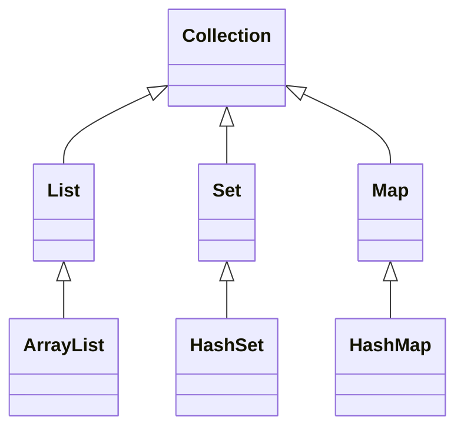

## Chapter 4. 배열과 컬렉션

### 4.1 배열(Arrays)

- **배열**은 같은 타입의 여러 데이터를 하나의 변수로 관리하는 자료구조  
- 인덱스(index)를 사용해 각 요소에 접근 (0부터 시작)  
- 크기가 고정되어 생성 후 변경 불가

#### 4.1.1 배열 선언과 생성
```java
int[] numbers; // 배열 선언
numbers = new int; // 크기 5인 배열 생성

text

또는 한 줄로 선언과 생성

int[] numbers = new int;

```

#### 4.1.2 배열 초기화
```java
int[] scores = {90, 85, 100, 70, 95};

text

#### 4.1.3 배열 요소 접근 및 수정

int firstScore = scores; // 첫 번째 요소 접근
scores = 80; // 세 번째 요소 값 수정

```

#### 4.1.4 배열 반복문 처리
```java
for (int i = 0; i < scores.length; i++) {
System.out.println("점수 " + i + ": " + scores[i]);
}

```

또는 향상된 for문
```java
for (int score : scores) {
System.out.println("점수: " + score);
}

```
---

### 4.2 다차원 배열(Multi-dimensional Arrays)

- 배열 안에 배열을 요소로 가지는 구조 (행렬, 표 등 표현 가능)

#### 4.2.1 2차원 배열 선언 및 초기화
```java
int[][] matrix = {
{1, 2, 3},
{4, 5, 6}
};

```

#### 4.2.2 2차원 배열 요소 접근
```java
int value = matrix; // 6
matrix = 10; // 2번째 요소 값을 10으로 변경

```
#### 4.2.3 2차원 배열 반복문
```java
for (int i = 0; i < matrix.length; i++) {
for (int j = 0; j < matrix[i].length; j++) {
System.out.print(matrix[i][j] + " ");
}
System.out.println();
}

```

---

### 4.3 배열의 한계와 컬렉션(Collection)

- 배열은 크기가 고정되어 있고, 삽입/삭제가 불편함  
- **컬렉션(Collection)**은 크기가 가변적이고 다양한 자료구조(리스트, 집합, 맵 등)를 제공

---

### 4.4 List (ArrayList)

- **ArrayList**는 가장 많이 쓰이는 동적 배열 컬렉션  
- 요소 삽입, 삭제, 검색이 편리함

#### 4.4.1 ArrayList 선언과 사용
```java
import java.util.ArrayList;

ArrayList<String> fruits = new ArrayList<>();
fruits.add("사과");
fruits.add("바나나");
fruits.add("오렌지");

System.out.println(fruits.get(1)); // 바나나
fruits.set(2, "포도"); // 2번째 값 변경
fruits.remove("사과"); // "사과" 삭제

for (String fruit : fruits) {
System.out.println(fruit);
}

```

---

### 4.5 Set (HashSet)

- **Set**은 중복을 허용하지 않는 집합 자료구조  
- 대표적으로 HashSet 사용
```java
import java.util.HashSet;

HashSet<Integer> numbers = new HashSet<>();
numbers.add(10);
numbers.add(20);
numbers.add(10); // 중복 추가, 무시됨

for (int num : numbers) {
System.out.println(num);
}

```

---

### 4.6 Map (HashMap)

- **Map**은 키(key)-값(value) 쌍으로 데이터를 저장  
- 대표적으로 HashMap 사용
```java
import java.util.HashMap;

HashMap<String, Integer> scores = new HashMap<>();
scores.put("홍길동", 90);
scores.put("김철수", 85);

System.out.println(scores.get("홍길동")); // 90

for (String name : scores.keySet()) {
System.out.println(name + ": " + scores.get(name));
}

```

---

### 4.7 컬렉션 클래스 구조 (다이어그램)

---

### 4.8 배열과 컬렉션 비교

| 구분      | 배열(Array)         | 컬렉션(Collection)          |
|-----------|---------------------|-----------------------------|
| 크기      | 고정                | 가변                        |
| 자료형    | 기본형/참조형 모두   | 참조형만 가능               |
| 삽입/삭제 | 불편                | 편리                        |
| 주요 종류 | 1차원, 2차원 등     | List, Set, Map 등           |

---

### 4.9 실습 문제

1. 정수 5개를 입력받아 배열에 저장하고, 모든 요소의 합을 출력하는 프로그램 작성  
2. ArrayList에 학생 이름을 저장하고, 모든 이름을 출력하는 코드 작성  
3. HashMap을 사용해 학생 이름과 점수를 저장하고, 이름별로 점수를 출력하는 코드 작성  
4. 2차원 배열을 생성하여 구구단(2~9단)을 출력해보기

---

### 4.10 참고자료

- 자바 공식 문서: 배열과 컬렉션  
- 생활코딩 - 자바 배열, ArrayList 강의  
- 인프런 - 자바 자료구조 강의
